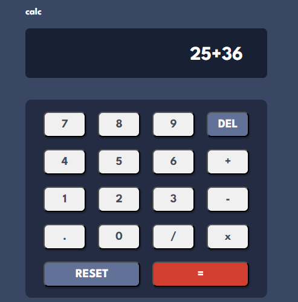

# Calculadora

O projeto tem como propósito o desenvolvimento de uma calculadora Web, visando aprimorar minhas competências em Front-End.

## Recursos Utilizados

 

## Funcionalidades

- Soma
- Subtração
- Multiplicação
- Divisão
- Deletar
- Resetar

## Projeto

